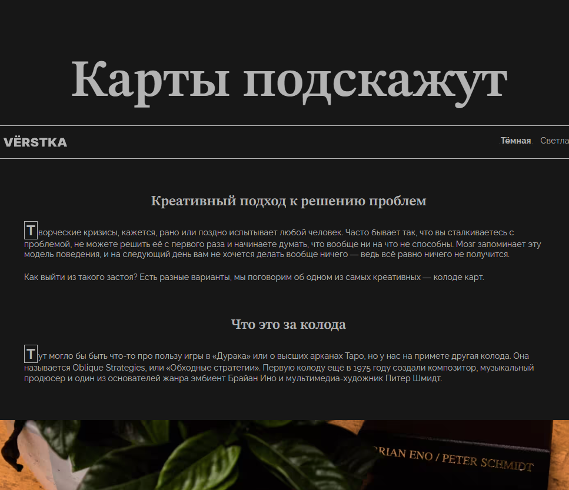
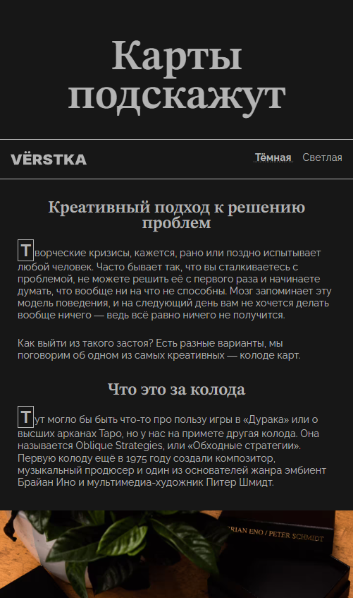
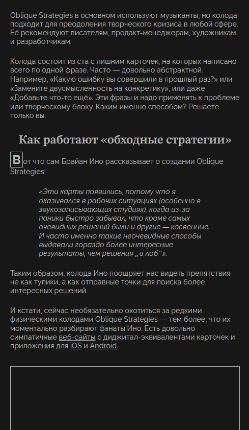
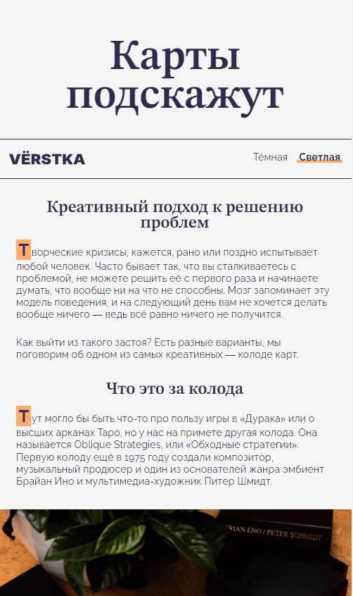
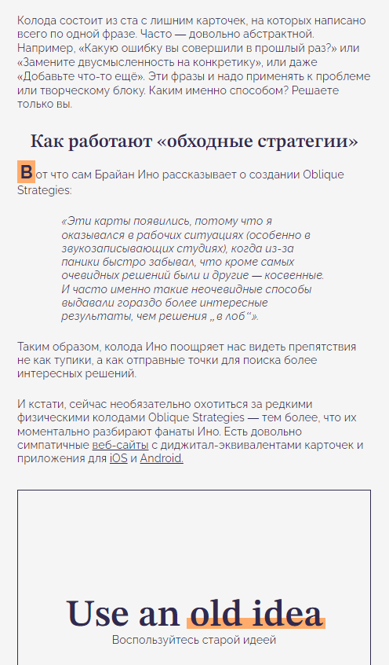

https://github.com/RiconCla/karty-podskazhut-main.git
# Мини-работа "Карты подскажут"

## Оглавление

- [Запуск](#запуск)
- [Скриншоты](#скриншоты)
- [Описание](#описание)
- [Благодарность](#благодарность)

### Запуск

Достаточно перейти на [GitHub Pages](https://riconcla.github.io/karty-podskazhut-main/)

### Скриншоты

### Описание

Проект о применении коллод для выхода из застоя. В данной работе реализован адаптивный дизайн без использования media queries. Также реализованы Темная и Светлая темы.

Использованные технологии: HTML, CSS, FLEX, BEM, Responsive, JS

[Макет](https://www.figma.com/design/ZyZg9Dc2CwGg221qJ7ibAn/%235-%D0%9A%D0%B0%D1%80%D1%82%D1%8B-%D0%BF%D0%BE%D0%B4%D1%81%D0%BA%D0%B0%D0%B6%D1%83%D1%82-(Copy)?node-id=0-1&t=UfwgY3CCnRbic9HM-1)

## Благодарность

Благодарю команду Яндекс Практикум за предоставление дизайна и уроков!